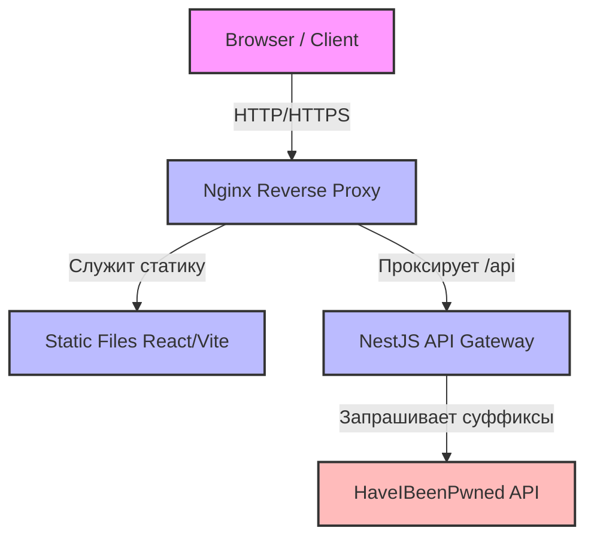
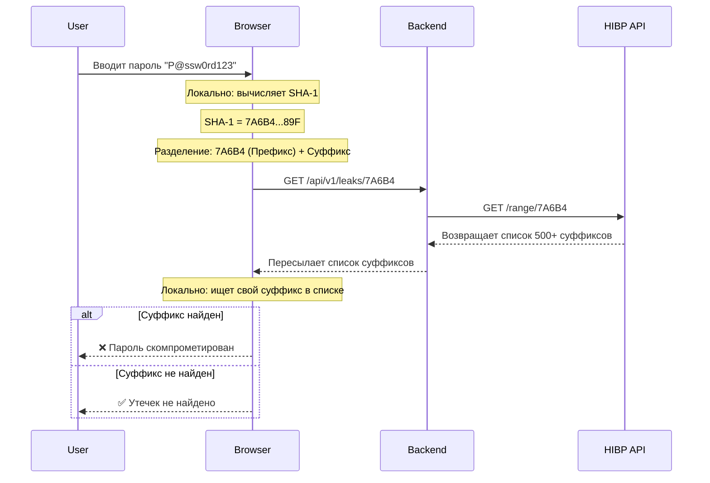

# Архитектура и Техническая Документация (PassCheck)

## 1. Введение и Обзор Проекта

**PassCheck** — это современное full-stack веб-приложение, предназначенное для всестороннего анализа надежности пользовательских паролей, их генерации и безопасной проверки на наличие в базах известных утечек (компрометаций).

В отличие от многих онлайн-чекеров паролей, которые могут сохранять введенные данные или передавать их по сети в открытом виде, PassCheck спроектирован вокруг концепции **"Zero-Knowledge"** (нулевого разглашения) и **k-Anonymity**.

### Ключевые принципы:
- **k-Anonymity (k-Анонимность):** Пароль пользователя **никогда** не покидает пределы его браузера в открытом или полностью захешированном виде. Мы используем модель частичного раскрытия хеша, что математически исключает возможность компрометации пароля со стороны нашего сервера, провайдера API или при перехвате трафика.
- **Client-Side обработка (Offloading):** Вся ресурсоемкая вычислительная работа перенесена на сторону клиента. Анализ энтропии пароля, расчет времени на его брутфорс (взлом), проверка на наличие спецсимволов и первичное хеширование (через алгоритм SHA-1) выполняются локально процессором пользователя.
- **Безопасность по умолчанию (Security-First):** Наш Backend выполняет исключительно функцию защищенного API-шлюза (Gateway). Он скрывает реальный IP-адрес пользователя от внешнего провайдера утечек (HaveIBeenPwned) и жестко защищен механизмами Rate Limiting, строгой валидацией DTO (Data Transfer Objects) и настроенными HTTP-заголовками через Helmet.

### Технологический стек:
- **Frontend:** React 19, TypeScript, Vite (сборщик), Tailwind CSS 4 (стилизация), Web Crypto API (нативное хеширование).
- **Backend:** NestJS (фреймворк), RxJS / Axios (работа с внешним API), Helmet & Throttler (безопасность).
- **Инфраструктура:** Docker, Docker Compose, Nginx (reverse-proxy, балансировщик и веб-сервер для раздачи статических ассетов).

---

## 2. Архитектура Системы (System Architecture)

Архитектура построена по модульной модели с четким разделением фронтенда и бэкенда, что позволяет масштабировать их независимо друг от друга.

### 2.1 Высокоуровневая схема (High-Level Architecture)



1. **Frontend (SPA):** Загружается в браузер пользователя. Отвечает за UI, локальные вычисления (анализ надежности) и отправку частичных данных (префиксов).
2. **Nginx (в Production):** Точка входа для всего трафика. Эффективно раздает статические файлы Frontend-а (HTML, JS, CSS) и проксирует API-запросы на Backend-контейнер.
3. **Backend (NestJS):** Принимает запросы, валидирует их, ограничивает спам (Rate Limiting) и делает защищенный запрос к внешнему провайдеру утечек.
4. **HaveIBeenPwned API:** Внешний сервис, предоставляющий базу данных утекших паролей.

### 2.2 Схема потока данных (Data Flow) - Проверка k-Anonymity

Процесс проверки пароля устроен так, чтобы гарантировать абсолютную приватность пользователя.



### 2.3 Структура репозитория
- `/password-analyzer-frontend/` — Исходный код SPA (React + Vite). Содержит компоненты интерфейса и изолированную логику вычислений (`/src/utils/passwordAnalyzer.ts` и `/src/utils/leakChecker.ts`).
- `/password-analyzer-backend/` — API-сервер на фреймворке NestJS. Структурирован по модулям (`app`, `leaks`, `health`).
- `docker-compose.yml` — Конфигурация для локальной разработки (Dev Mode).
- `docker-compose.prod.yml` — Конфигурация для Production-развертывания.
- `Dockerfile.*` — Инструкции по сборке образов контейнеров.
- `nginx.conf` — Конфигурация маршрутизации для Production.

---

## 3. Инфраструктура и Развертывание (Deployment)

Проект полностью контейнеризирован с использованием Docker. Это устраняет проблему "на моей машине работает" и гарантирует идентичность поведения кода во всех средах.

### 3.1 Требования к окружению
- **Система контроля версий:** Git. 
  - *Важно для Windows:* обязательно выполнить `git config --global core.autocrlf true`, чтобы избежать проблем с символами переноса строки (`\r\n` vs `\n`) в bash-скриптах внутри контейнеров Linux.
- **Движок контейнеров:** Docker Desktop (Для Windows обязательно включить интеграцию с WSL 2 для обеспечения высокой производительности файловой системы).
- **Node.js 22+:** Требуется только в том случае, если вы планируете запускать проект без использования Docker.

### 3.2 Локальная разработка (Dev Mode)

В режиме разработки фокус сделан на скорость обратной связи. Мы используем Hot-Module Replacement (HMR) для фронтенда и Watcher для бэкенда.

**Запуск:**
```bash
docker-compose up --build
```

**Особенности:**
- **Volumes (Проброс папок):** Директории с вашим исходным кодом монтируются напрямую внутрь контейнеров. Любые изменения в IDE мгновенно отражаются в приложении без пересборки образов.
- **Сетевые порты:** 
  - Frontend доступен по адресу: `http://localhost:3000`
  - Backend API напрямую доступен по адресу: `http://localhost:3001`
- **Зависимости:** Папки `node_modules` кэшируются внутри Docker-тома, чтобы не конфликтовать с локальной ОС.

### 3.3 Продакшн окружение (Prod Mode)

В боевом режиме приоритет отдается безопасности, производительности и минимальному размеру. Мы используем паттерн **Multi-stage build** в Dockerfiles.

**Процесс Multi-stage сборки:**
1. **Сборка (Builder):** Устанавливаются все зависимости, компилируется TypeScript, проект минифицируется (создается папка `/dist`).
2. **Запуск (Runner):** В финальный, минимальный образ (например, `alpine`) копируются только скомпилированные артефакты, без исходников и лишних `devDependencies`.

**Запуск:**
```bash
docker-compose -f docker-compose.prod.yml up -d --build
```

**Особенности Production:**
- **Nginx как единое окно:** Пользователь не обращается напрямую к портам 3000 или 3001. Весь трафик идет через стандартный порт `80` (или `443` при настройке SSL) к Nginx.
- Nginx перехватывает запросы к `/api` и скрыто проксирует их во внутреннюю сеть Docker к контейнеру Backend.
- Статические файлы React кэшируются и отдаются Nginx-ом, что снимает нагрузку с Node.js.

### 3.4 Переменные окружения (Environment Variables)

Для гибкой настройки в проекте поддерживаются переменные окружения.
- **FRONTEND:** Vite позволяет прокидывать переменные, начинающиеся с `VITE_`.
- **BACKEND:** 
  - `PORT` — Порт, на котором слушает NestJS (по умолчанию `3001`).
  - `FRONTEND_ORIGIN` — Домен вашего фронтенда. Критически важен для настройки политик CORS. В проде должен указывать на ваш реальный домен (например, `https://mypwcheck.com`).

---

## 4. Frontend Документация (React + Vite)

Frontend-приложение спроектировано с упором на скорость работы и изолированность бизнес-логики от UI-компонентов. Вся тяжелая логика выполняется в браузере клиента.

### 4.1 Структура директории `src`
- `/components` — Содержит переиспользуемые UI-компоненты:
  - `PasswordInput` — поле ввода со скрытием/показом пароля.
  - `StrengthMeter` — визуальный прогресс-бар, отображающий уровень надежности (от 0 до 4). Конфигурация цветов (от красного `#ef4444` до зеленого `#06d6a0`) вынесена в отдельную мапу мета-данных.
  - `GeneratorControls` — интерфейс для настройки длины и используемых символов при генерации.
- `/utils` — Ядро бизнес-логики (Чистые функции):
  - `passwordAnalyzer.ts` — Эвристический анализатор, использующий библиотеку `@zxcvbn-ts/core` (современный форк zxcvbn от Dropbox). Он оценивает энтропию пароля по формуле `Math.log2(guesses)`, где `guesses` — количество попыток для угадывания. Функция возвращает оценку от 0 до 4 и примерное время брутфорса (`crackTimeSeconds`).
  - `leakChecker.ts` — Работает с нативным **Web Crypto API** (`crypto.subtle.digest('SHA-1', data)`). Превращает пароль в Uint8Array хеш, обрезает его до префикса (5 символов) и отправляет `fetch` запрос на Backend. После получения ответа локально ищет `suffix` в строках, разделенных `\r\n`.
- `types.ts` — Глобальные интерфейсы TypeScript (например, `PasswordAnalysis`, `LeakStatus`).

### 4.2 Управление состоянием (State Management)
Проект сознательно избегает тяжелых стейт-менеджеров вроде Redux или MobX.
- Вся реактивность построена на нативных **React Hooks** (`useState`, `useEffect`, `useCallback`).
- Для сложных форм состояние консолидируется в родительском компоненте `App.tsx` и передается вниз (Prop Drilling), так как глубина дерева компонентов не превышает 2-3 уровней.

### 4.3 Стилизация
Используется **Tailwind CSS v4**.
- Отказ от глобальных CSS-файлов в пользу Utility-First подхода.
- Дизайн адаптивен (Mobile-First) и поддерживает автоматическое переключение темной/светлой темы на основе системных настроек браузера.

---

## 5. Backend Документация (API Reference)

Backend построен на фреймворке **NestJS**. Он выполняет роль защищенного прокси-слоя (BFF - Backend For Frontend). База данных не используется (Stateless архитектура).

### 5.1 Контроллеры и Эндпоинты

Глобальный префикс API: `/api/v1`

#### `GET /api/v1/leaks/:prefix` (Контроллер `LeaksController`)
Основной эндпоинт для проверки префикса хеша.
- **Параметры пути:** `prefix` (строка, ровно 5 символов, 16-ричный формат).
- **Валидация (DTO):** Используется глобальный `ValidationPipe` с настройками `transform: true` и `whitelist: true`. Если префикс не проходит проверку, запрос отклоняется (400 Bad Request) еще до попадания в контроллер.
- **Логика (`LeaksService`):**
  1. Сервис сначала проверяет локальный in-memory кэш (`Map<string, string>`). Если префикс уже искали, ответ отдается мгновенно (Cache HIT).
  2. При промахе кэша (Cache MISS) делает HTTP GET запрос через `axios` к `https://api.pwnedpasswords.com/range/:prefix`.
  3. В запрос добавляется заголовок `Add-Padding: 'true'`. Это заставляет API HaveIBeenPwned добавлять фейковые суффиксы в ответ до фиксированного размера, что защищает от атак анализа трафика (Traffic Analysis).
- **Отказоустойчивость:** Интегрирован пакет `axios-retry`. Если сервер HIBP возвращает ошибку 5xx или происходит сетевой сбой, Backend сделает 3 повторные попытки с экспоненциальной задержкой (Exponential Backoff: ~1с, ~2с, ~4с).
- **Ответ:** Отдает `text/plain; charset=utf-8` напрямую от HIBP, избегая оверхеда на парсинг JSON.

#### `GET /api/v1/health`
- Эндпоинт для Liveness / Readiness Probes. Используется Docker Compose и Nginx для проверки доступности контейнера перед направлением на него трафика.

### 5.2 Обработка ошибок (Error Handling)
Все ошибки перехватываются встроенным фильтром NestJS. Ошибки стандартизированы в JSON:
- **400 Bad Request:** Если `prefix` не прошел валидацию (например, длина не 5 символов).
- **429 Too Many Requests:** Если сработал Throttler Guard (Rate Limit).
- **500 Internal Server Error:** Выбрасывается как `InternalServerErrorException`, если сервис HIBP недоступен после всех попыток Retry.

---

## 6. Безопасность (Security Analysis)

Архитектура безопасности — это ключевая особенность проекта. Защита реализуется на трех уровнях (Концептуальный, Сетевой, Клиентский).

### 6.1 Математика k-Anonymity
Хеш-алгоритм SHA-1 выдает строку длиной 40 символов в 16-ричной системе. 
Отправляя только **первые 5 символов** (префикс), мы создаем $16^5 = 1,048,576$ возможных "корзин". Каждая корзина на серверах HIBP содержит в среднем около 800 суффиксов.
- Наш Backend и сервер HIBP знают только то, что пароль пользователя находится *где-то среди этих 800 вариантов*.
- Идентифицировать конкретный пароль невозможно, так как суффикс (остальные 35 символов) никогда не покидает браузер. Сверка происходит локально в памяти вкладки.

### 6.2 Сетевая защита Backend (`main.ts`)
Бэкенд агрессивно защищает себя от зловредного трафика:
1. **Helmet (HTTP Headers):**
   - `Content-Security-Policy: default-src 'none'` — Гарантирует, что API не может исполнять или загружать скрипты, защищая от XSS.
   - `Strict-Transport-Security (HSTS)` — Запрещает браузерам подключаться к API по незашифрованному HTTP протоколу.
   - `X-Content-Type-Options: nosniff` — Запрещает изменение типа контента (MIME-сниффинг).
2. **CORS (Cross-Origin Resource Sharing):** 
   - Настроено жесткое правило: `origin: process.env.FRONTEND_ORIGIN`. Запросы принимаются только с домена нашего Frontend-а.
   - Разрешен **исключительно метод GET**. Никакие POST/PUT запросы не поддерживаются, что исключает возможность случайной передачи пароля в теле (Body) запроса.
3. **Throttler (Rate Limiting):**
   - Установлено ограничение: максимум 10 запросов в секунду с одного IP-адрес. Это защищает систему от брутфорса самого API и предотвращает блокировку нашего сервера со стороны HaveIBeenPwned.

### 6.3 Безопасность Frontend
- **Отсутствие NPM-зависимостей для криптографии:** Хеширование реализовано исключительно через нативный Web Crypto API (`window.crypto.subtle`). Это устраняет риск Supply Chain Attack (заражения через сторонние библиотеки).
- **Требование Secure Context:** Web Crypto API функционирует только при загрузке страницы по `https://` (или `http://localhost`). Если сайт развернут неправильно (по HTTP), приложение безопасно откажется работать, не подвергая пароль риску перехвата.

---

## 7. Развитие и Поддержка (Runbook / Contribution Guide)

### Соглашения по коду (Code Style)
- Код автоматически проверяется с помощью **ESLint** (правила в `eslint.config.mjs`) и **Prettier** (`.prettierrc`).
- Включен режим Strict TypeScript (`tsconfig.json: "strict": true`).

### Логирование и Мониторинг
Все важные события логируются через встроенный `Logger` NestJS.
Чтобы посмотреть логи бэкенда в Docker:
```bash
docker logs <container_name> -f
```

### Решение частых проблем (Troubleshooting)
1. **Ошибки Web Crypto API (crypto.subtle is undefined):**
   - *Проблема:* Хеширование на Frontend не работает, консоль выдает ошибку.
   - *Решение:* Браузер требует **Secure Context**. Убедитесь, что вы открываете сайт через `localhost` или настроили `https://` (через сертификаты в Nginx при деплое). По IP-адресу без HTTPS функция работать не будет (за исключением локального тестирования).
2. **Ошибки с переносами строк (Windows):**
   - *Проблема:* Скрипты bash в Docker ругаются на `\r`.
   - *Решение:* Измените перенос строк у файлов на `LF` (вместо `CRLF`) в вашей IDE.

### Дальнейшее развитие (Roadmap)
- Добавление Unit и E2E тестирования (Jest / Vitest).
- Настройка CI/CD (GitHub Actions) для автоматической сборки Docker-образов.
- Расширение функционала генератора паролей (экспорт, произносимые пароли).
