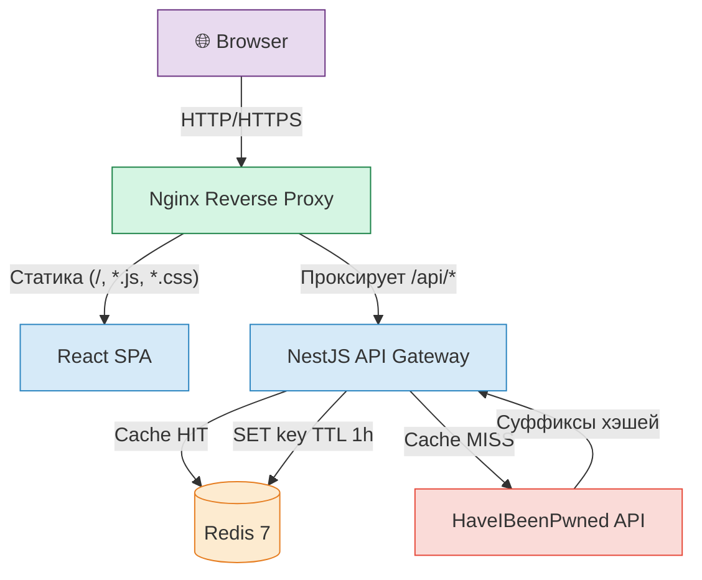
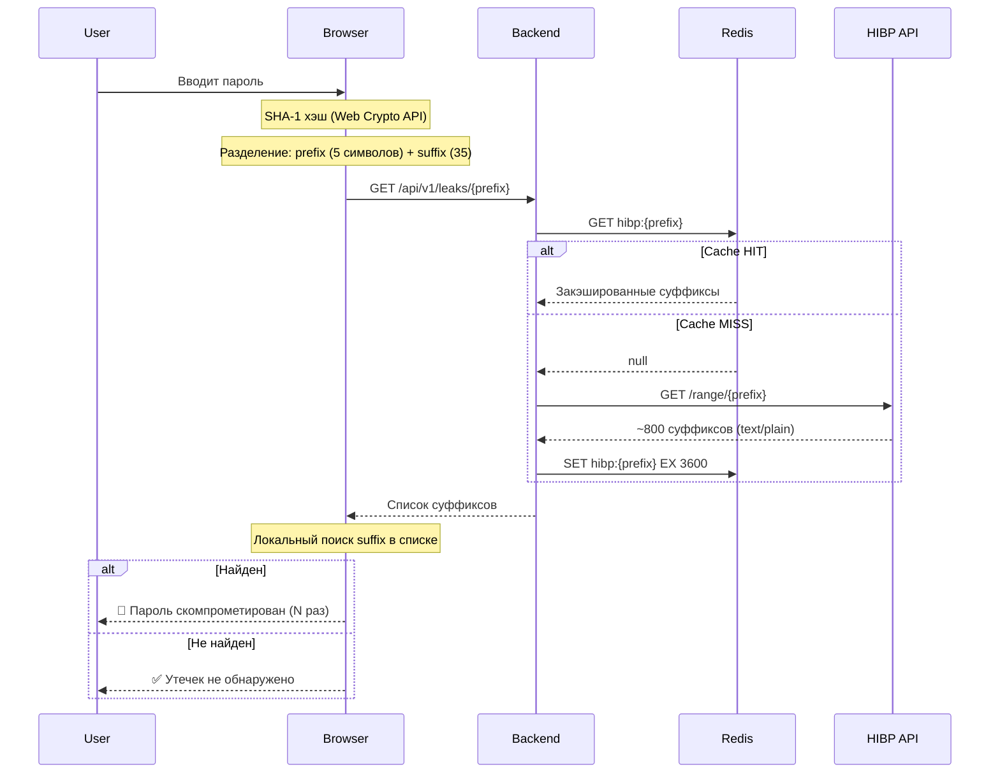

# Архитектура и Техническая Документация — PassCheck

## 1. Обзор проекта

**PassCheck** — full-stack веб-приложение для анализа надёжности паролей и безопасной проверки на наличие в базах утечек. Построено на принципах **Zero-Knowledge** и **k-Anonymity**: пароль пользователя никогда не покидает браузер.

### Технологический стек

| Слой           | Технологии                                                    |
| -------------- | ------------------------------------------------------------- |
| Frontend       | React 19, TypeScript, Vite, Tailwind CSS 4, Web Crypto API    |
| Backend        | NestJS 11, Axios + retry, Helmet, Throttler, Pino (логи)      |
| База данных    | Redis 7 (кэш HIBP-ответов + сессии пользователей)             |
| Инфраструктура | Docker, Docker Compose, Nginx (reverse proxy), GitHub Actions |

---

## 2. Архитектура системы

### 2.1 Высокоуровневая схема



**Компоненты:**

1. **Frontend (SPA)** — загружается в браузер. Анализ пароля (zxcvbn), SHA-1 хэширование (Web Crypto API), отображение результатов.
2. **Nginx** (Production) — единая точка входа. Раздаёт статику и проксирует `/api/*` на Backend.
3. **Backend (NestJS)** — API-шлюз. Принимает prefix, проверяет Redis-кэш, при промахе обращается к HIBP.
4. **Redis** — key-value хранилище для двух задач: кэш HIBP-ответов и хранение данных сессий.
5. **HaveIBeenPwned API** — внешний сервис утёкших паролей.

### 2.2 Поток данных — проверка k-Anonymity



---

## 3. База данных — Redis

### 3.1 Роль Redis в проекте

Redis используется как **единственное хранилище данных** в проекте. Он выполняет две функции:

| Функция  | Ключ            | TTL      | Описание                               |
| -------- | --------------- | -------- | -------------------------------------- |
| Кэш HIBP | `hibp:<prefix>` | 1 час    | Ответы HaveIBeenPwned API (text/plain) |
| Сессии   | `session:<ip>`  | 30 минут | JSON с данными активности пользователя |

### 3.2 Конфигурация Redis

Redis запускается через Docker с жёсткими ограничениями:

```yaml
# docker-compose.yml
redis:
  image: redis:7-alpine
  command: >
    redis-server
    --appendonly yes          # AOF-персистентность (данные переживают рестарт)
    --maxmemory 128mb        # Ограничение памяти
    --maxmemory-policy allkeys-lru  # При заполнении — вытесняем старые ключи
```

**Переменные окружения:**

| Переменная   | По умолчанию | Описание                       |
| ------------ | ------------ | ------------------------------ |
| `REDIS_HOST` | `redis`      | Имя хоста (имя Docker-сервиса) |
| `REDIS_PORT` | `6379`       | Порт Redis                     |

### 3.3 Структура данных

#### Кэш HIBP (`hibp:<prefix>`)

```
Ключ:     hibp:7A6B4
Значение: "0018A45C4D1DEF81644B54AB7F969B88D65:1\r\n00D4F6E8FA6EECAD2A3AA415EEC418D38EC:2\r\n..."
TTL:      3600 секунд (1 час)
```

Данные хранятся в формате `text/plain` (как возвращает HIBP API). Каждая строка: `SUFFIX:COUNT\r\n`.

#### Сессии пользователей (`session:<ip>`)

```json
{
  "ip": "172.18.0.1",
  "userAgent": "Mozilla/5.0 ...",
  "createdAt": "2026-06-08T17:00:00.000Z",
  "lastSeenAt": "2026-06-08T17:05:30.000Z",
  "totalRequests": 12,
  "leakChecks": 5,
  "logs": [
    {
      "timestamp": "2026-06-08T17:05:30.000Z",
      "method": "GET",
      "route": "/api/v1/leaks/:prefix",
      "statusCode": 200,
      "responseTimeMs": 45
    }
  ]
}
```

> **Конфиденциальность:** В поле `route` записывается только _паттерн_ маршрута (`/leaks/:prefix`), а не реальные значения prefix. Сессии автоматически удаляются через 30 минут неактивности.

### 3.4 Отказоустойчивость (Fallback)

`RedisService` реализует паттерн **graceful degradation**:

- При недоступности Redis автоматически переключается на `in-memory Map`.
- Приложение продолжает работать — просто без персистентного кэша.
- При восстановлении соединения Redis снова становится основным хранилищем.
- До 10 попыток переподключения с экспоненциальной задержкой (макс. 5 сек).

### 3.5 Работа с Redis через CLI

```bash
# Войти в Redis CLI внутри контейнера
docker compose exec redis redis-cli

# Посмотреть все ключи кэша HIBP
KEYS hibp:*

# Посмотреть все активные сессии
KEYS session:*

# Получить данные конкретной сессии
GET session:172.18.0.1

# Проверить оставшееся время жизни ключа (в секундах)
TTL hibp:7A6B4

# Посмотреть использование памяти
INFO memory

# Полностью очистить кэш
FLUSHALL
```

---

## 4. Frontend

### 4.1 Структура `frontend/src/`

```
src/
├── main.tsx                  # Точка входа React
├── App.tsx                   # Главный компонент (композиция)
├── index.css                 # Дизайн-система (Tailwind + анимации)
├── api/
│   └── apiClient.ts          # HTTP-клиент (fetch → /api/v1/leaks)
├── components/
│   ├── PasswordInput.tsx     # Поле ввода с toggle видимости
│   ├── StrengthMeter.tsx     # Визуальный индикатор силы (5 сегментов)
│   ├── AnalysisResults.tsx   # Метрики + статус утечек
│   └── PasswordGenerator.tsx # Генератор с настройками
├── hooks/
│   ├── usePasswordAnalysis.ts  # Оркестратор: анализ + debounced leak check
│   └── usePasswordGenerator.ts # Логика генерации (crypto.getRandomValues)
├── services/
│   └── leakChecker.ts        # k-Anonymity: SHA-1 → prefix/suffix → API
├── utils/
│   └── passwordAnalyzer.ts   # Локальный анализ (zxcvbn-ts)
└── __tests__/
    └── passwordAnalyzer.test.ts
```

### 4.2 Ключевые решения

- **Нет стейт-менеджера** — глубина дерева компонентов ≤ 3, достаточно `useState` + `useCallback`.
- **Web Crypto API** вместо npm-библиотек для SHA-1 — устраняет риск Supply Chain Attack.
- **Debounce 600ms** перед проверкой утечек — не спамим API при быстром наборе.
- **Tailwind CSS v4** — подключён через `@tailwindcss/vite` плагин.

---

## 5. Backend — API Reference

### 5.1 Модульная структура

```
backend/src/
├── main.ts           # Bootstrap: Helmet, CORS, ValidationPipe, Swagger
├── app.module.ts     # Корневой модуль: Config, Throttler, Logger
├── common/
│   ├── decorators/   # @UserIp — извлечение IP из X-Forwarded-For
│   ├── filters/      # AllExceptionsFilter — унифицированные ошибки
│   └── interceptors/ # SessionInterceptor — логирование запросов
├── health/
│   ├── health.module.ts
│   └── health.controller.ts   # GET /api/v1/health
├── leaks/
│   ├── leaks.module.ts
│   ├── leaks.controller.ts    # GET /api/v1/leaks/:prefix
│   ├── leaks.service.ts       # Логика: Redis → HIBP → cache
│   ├── leaks.service.spec.ts  # Unit-тесты
│   └── dto/prefix.param.dto.ts
├── redis/
│   ├── redis.module.ts        # @Global() — доступен везде
│   └── redis.service.ts       # ioredis + fallback Map
└── session/
    ├── session.module.ts      # @Global() + APP_INTERCEPTOR
    └── session.service.ts     # Tracking по IP в Redis
```

### 5.2 Эндпоинты

| Метод | Путь                    | Описание                           | Ответ              |
| ----- | ----------------------- | ---------------------------------- | ------------------ |
| GET   | `/api/v1/leaks/:prefix` | Проверка prefix хэша (k-Anonymity) | `text/plain`       |
| GET   | `/api/v1/health`        | Health check (Docker / мониторинг) | `application/json` |
| GET   | `/api/docs`             | Swagger UI документация            | HTML               |

### 5.3 Валидация

```typescript
// dto/prefix.param.dto.ts
@Matches(/^[A-Fa-f0-9]{5}$/)
prefix: string;  // Ровно 5 hex-символов
```

Невалидный prefix → `400 Bad Request` до попадания в контроллер.

### 5.4 Защита

| Механизм       | Настройка                        | Назначение                    |
| -------------- | -------------------------------- | ----------------------------- |
| Helmet         | CSP, HSTS, X-Frame-Options       | HTTP-заголовки безопасности   |
| CORS           | `origin: FRONTEND_ORIGIN`, `GET` | Только GET с нашего фронтенда |
| Throttler      | 10 req/sec/IP                    | Защита от брутфорса           |
| Axios Retry    | 3 попытки, exponential backoff   | Отказоустойчивость к HIBP     |
| ValidationPipe | `whitelist: true`, `transform`   | Отсечение лишних полей        |

---

## 6. Инфраструктура — Docker

### 6.1 Режимы запуска

| Режим       | Файл                      | Команда                                                   |
| ----------- | ------------------------- | --------------------------------------------------------- |
| Development | `docker-compose.yml`      | `docker compose up --build`                               |
| Production  | `docker-compose.prod.yml` | `docker compose -f docker-compose.prod.yml up -d --build` |

### 6.2 Dev-режим

- **Hot-reload**: исходники монтируются в контейнеры через volumes.
- **Порты**: Frontend → `:3000`, Backend → `:3001`, Redis → `:6379`.
- **node_modules**: хранятся в Docker-volume (не конфликтуют с хостом).

### 6.3 Production-режим

- **Multi-stage build**: минимальные образы без dev-зависимостей.
- **Nginx** — единая точка входа на порту `80`.
- Нет проброса портов Backend/Redis наружу (доступны только внутри Docker-сети).

### 6.4 Переменные окружения

| Переменная         | По умолчанию            | Описание                         |
| ------------------ | ----------------------- | -------------------------------- |
| `PORT`             | `3001`                  | Порт NestJS API                  |
| `FRONTEND_ORIGIN`  | `http://localhost:3000` | Разрешённый origin для CORS      |
| `REDIS_HOST`       | `redis`                 | Хост Redis (имя Docker-сервиса)  |
| `REDIS_PORT`       | `6379`                  | Порт Redis                       |
| `VITE_BACKEND_URL` | `http://localhost:3001` | URL бэкенда для Vite proxy (dev) |

---

## 7. Безопасность — k-Anonymity

### Математика

SHA-1 → 40 hex-символов. Отправляя только **5 первых** (prefix):

- Количество «корзин»: `16^5 = 1 048 576`
- В каждой корзине: ~800 суффиксов
- Сервер знает, что пароль _где-то среди 800 вариантов_ — бесполезно

Суффикс (35 символов) **никогда не покидает браузер**. Сверка происходит локально.

### Padding

Заголовок `Add-Padding: true` заставляет HIBP дополнять ответ случайными записями до фиксированного размера — защита от traffic analysis.

---

## 8. Troubleshooting

### crypto.subtle is undefined

**Причина:** Браузер требует Secure Context (HTTPS или localhost).
**Решение:** Открывайте через `http://localhost:3000` или настройте HTTPS.

### Нативные модули не найдены в Docker (rollup, tailwindcss/oxide)

**Причина:** `package-lock.json` с хоста фиксирует бинарники для glibc, а Docker Alpine использует musl.
**Решение:** Dockerfiles НЕ копируют `package-lock.json`. Вместо `npm ci` используется `npm install`.

### HIBP API недоступен

**Причина:** Провайдер блокирует DNS.
**Решение:** В `docker-compose.yml` настроены DNS Google (`8.8.8.8`, `8.8.4.4`).
