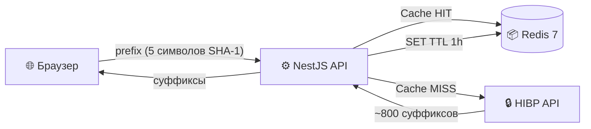

<<<<<<< HEAD

# 🛡️ PassCheck — Password Analyzer & Leak Checker

Современное веб-приложение для анализа надёжности паролей и проверки на наличие в базах утечек.
Построено на принципе **Zero-Knowledge** — пароль никогда не покидает ваш браузер.

## ✨ Основные возможности

- **Локальный анализ** — оценка энтропии, времени взлома и рекомендации через [zxcvbn-ts](https://github.com/zxcvbn-ts/zxcvbn)
- **k-Anonymity** — проверка по базе [HaveIBeenPwned](https://haveibeenpwned.com/API/v3#PwnedPasswords) без передачи пароля на сервер
- **Генератор паролей** — криптографически стойкая генерация через `crypto.getRandomValues`
- **Redis-кэширование** — мгновенные повторные проверки, отслеживание сессий
- **Безопасность** — Helmet, Rate-limiting (10 req/s/IP), строгий CORS, CSP-заголовки

## 🏗 Архитектура



> Сервер получает только 5 символов из 40-символьного SHA-1 хэша.
> Полный хэш и пароль **никогда** не покидают браузер.

## 🛠 Технологии

| Слой           | Стек                                              |
| -------------- | ------------------------------------------------- |
| Frontend       | React 19, TypeScript, Vite, Tailwind CSS 4        |
| Backend        | NestJS 11, Axios + retry, Helmet, Throttler, Pino |
| База данных    | Redis 7 (кэш HIBP + сессии, AOF, LRU, 128MB)      |
| Инфраструктура | Docker, Docker Compose, Nginx, GitHub Actions     |

---

## 📂 Структура проекта

```
PassCheck/
├── .github/                              # Скрипты GitHub Actions
│   └── workflows/
│       └── ci.yml                        # CI/CD пайплайн: линтинг, тесты, сборка Docker-образов
├── .husky/                               # Хуки Git (предотвращение плохих коммитов)
│   ├── _/                                # Системные файлы Husky
│   └── pre-commit                        # Скрипт проверки кода перед коммитом (lint-staged)
├── backend/                              # Бэкенд-сервис на базе NestJS (API Gateway)
│   ├── dist/                             # [Сгенерировано] Скомпилированный JavaScript
│   ├── node_modules/                     # Зависимости пакета backend
│   ├── src/                              # Исходный код бэкенда
│   │   ├── common/                       # Общие модули, утилиты, абстракции
│   │   │   ├── decorators/
│   │   │   │   └── user-ip.decorator.ts  # Декоратор для извлечения IP из X-Forwarded-For
│   │   │   ├── filters/
│   │   │   │   └── all-exceptions.filter.ts # Глобальный фильтр ошибок (приводит все ошибки к единому JSON формату)
│   │   │   └── interceptors/
│   │   │       └── session.interceptor.ts   # Глобальный перехватчик: логирует метаданные всех HTTP-запросов
│   │   ├── health/                       # Модуль проверки состояния сервиса (Liveness Probe)
│   │   │   ├── health.controller.ts      # GET /api/v1/health (Используется Docker и Nginx)
│   │   │   └── health.module.ts          # Инкапсуляция контроллера health
│   │   ├── leaks/                        # Основная бизнес-логика (интеграция с HIBP)
│   │   │   ├── dto/
│   │   │   │   └── prefix.param.dto.ts   # Строгая валидация (Class Validator): только 5 hex символов
│   │   │   ├── leaks.controller.ts       # GET /api/v1/leaks/:prefix
│   │   │   ├── leaks.module.ts           # Подключение сервиса и контроллера утечек
│   │   │   ├── leaks.service.spec.ts     # Unit-тесты для сервиса утечек
│   │   │   └── leaks.service.ts          # Логика: Redis-кэш → Axios (HIBP API) → Сохранение в кэш
│   │   ├── redis/                        # Управление базой данных Redis
│   │   │   ├── redis.module.ts           # Глобальный модуль (@Global)
│   │   │   └── redis.service.ts          # Обёртка над ioredis с in-memory fallback на случай сбоев БД
│   │   ├── session/                      # Система аналитики и трекинга пользователей
│   │   │   ├── session.module.ts         # Глобальный модуль
│   │   │   └── session.service.ts        # Сохранение агрегированных метрик по IP-адресу (TTL 30 минут)
│   │   ├── app.module.ts                 # Корневой модуль NestJS: регистрация Throttler, Config, Logger
│   │   └── main.ts                       # Входная точка приложения: Helmet, CORS, запуск прослушивания порта
│   ├── test/                             # Сквозное (E2E) тестирование
│   │   ├── app.e2e-spec.ts               # Интеграционные тесты API
│   │   └── jest-e2e.json                 # Конфиг Jest для E2E-тестов
│   ├── eslint.config.mjs                 # Правила статического анализа (ESLint 9 Flat Config)
│   ├── nest-cli.json                     # Конфигурация Nest-сборщика
│   ├── package.json                      # NPM зависимости (Nest, RxJS, class-validator)
│   ├── tsconfig.build.json               # Настройки TypeScript для prod-сборки (исключает тесты)
│   └── tsconfig.json                     # Общие настройки TypeScript для бэкенда
├── docker/                               # Конфигурация контейнеризации и деплоя
│   ├── nginx/
│   │   └── nginx.conf                    # Конфигурация веб-сервера (статический хостинг + proxy_pass для /api)
│   ├── .env.example                      # Заготовка переменных окружения (порты, хосты БД)
│   ├── backend.Dockerfile                # Образ для локальной разработки бэкенда (npm run start:dev)
│   ├── backend.prod.Dockerfile           # Prod образ бэкенда (Multi-stage сборка: builder -> runner)
│   ├── frontend.Dockerfile               # Образ для разработки фронтенда (Vite HMR)
│   └── frontend.prod.Dockerfile          # Prod образ фронтенда (Vite build, Nginx-runtime)
├── frontend/                             # Клиентская часть (React SPA)
│   ├── dist/                             # [Сгенерировано] Сборка приложения для продакшна
│   ├── node_modules/                     # Зависимости фронтенда
│   ├── src/                              # Исходники приложения
│   │   ├── api/
│   │   │   └── apiClient.ts              # Фасад для взаимодействия с NestJS API
│   │   ├── components/                   # UI компоненты (изолированные)
│   │   │   ├── AnalysisResults.tsx       # Вывод метрик анализа (энтропия, рекомендации, бейдж утечек)
│   │   │   ├── PasswordGenerator.tsx     # Интерфейс генератора паролей (ползунки, чекбоксы)
│   │   │   ├── PasswordInput.tsx         # Кастомный input с переключателем видимости
│   │   │   └── StrengthMeter.tsx         # Визуальный индикатор силы (5-сегментный светофор)
│   │   ├── hooks/                        # React Хуки для управления состоянием
│   │   │   ├── usePasswordAnalysis.ts    # Оркестратор: запускает zxcvbn и debounced запрос к API
│   │   │   └── usePasswordGenerator.ts   # Управление состоянием генератора паролей
│   │   ├── services/                     # Клиентские сервисы
│   │   │   └── leakChecker.ts            # Криптография (Web Crypto API): вычисление SHA-1 и проверка суффикса
│   │   ├── utils/                        # Чистые функции бизнес-логики
│   │   │   └── passwordAnalyzer.ts       # Настройка zxcvbn-ts, расчет энтропии
│   │   ├── __tests__/                    # Unit-тесты для логики фронтенда
│   │   │   └── passwordAnalyzer.test.ts  # Тесты анализатора паролей (Vitest)
│   │   ├── App.tsx                       # Корневой UI компонент (лейаут)
│   │   ├── index.css                     # Глобальные стили (Tailwind CSS v4 + кастомные классы)
│   │   ├── main.tsx                      # Точка входа React (ReactDOM.createRoot)
│   │   ├── setupTests.ts                 # Инициализация тестовой среды
│   │   └── vite-env.d.ts                 # Описание типов для импорта статики Vite
│   ├── index.html                        # Базовый HTML документ
│   ├── package.json                      # Зависимости фронтенда (React, Vite, Tailwind, Zxcvbn)
│   ├── tsconfig.json                     # Конфигурация TypeScript для React-кода
│   └── vite.config.ts                    # Настройка сборщика Vite (плагины, прокси к бэкенду)
├── node_modules/                         # Корневые зависимости (NPM Workspaces)
├── shared/                               # Общий код между фронтендом и бэкендом (npm package: @passcheck/shared)
│   ├── dist/                             # [Сгенерировано] Собранные типы
│   ├── node_modules/                     # Локальные зависимости shared-воркспейса
│   ├── types/
│   │   └── index.ts                      # Общие TypeScript интерфейсы (PasswordAnalysis, LeakStatus)
│   ├── package.json                      # Описание модуля
│   └── tsconfig.json                     # Настройки компилятора
├── .dockerignore                         # Файлы, исключаемые из Docker-контекста (ускорение сборки)
├── .gitignore                            # Игнорируемые Git файлы
├── docker-compose.prod.yml               # Production-деплой: Nginx + NestJS + Redis (использует Prod Dockerfiles)
├── docker-compose.yml                    # Local Dev: Vite + NestJS + Redis (монтирование исходников, HMR)
├── Makefile                              # Алиасы команд (make dev, make prod, make logs, make clean)
├── package-lock.json                     # Точное дерево версий npm пакетов (детерминированная сборка)
├── package.json                          # Корневой конфигуратор (workspaces: frontend, backend, shared), настройки Prettier
├── README.md                             # Стартовая страница проекта
├── tsconfig.json                         # Корневой TypeScript-конфиг (Project References)
└── DOCUMENTATION.md                  # Детальное описание архитектуры, k-Anonymity, Redis-схем
```

---

## 🚀 Быстрый старт

### Требования

- **Docker** (рекомендуется) или **Node.js 22+**
- **Git**

### Запуск через Docker (рекомендуется)

```bash
git clone https://github.com/kraaack1337/PassCheck.git
cd PassCheck
docker compose up --build
```

| Сервис       | URL                                  |
| ------------ | ------------------------------------ |
| Frontend     | http://localhost:3000                |
| Backend API  | http://localhost:3001/api/v1/health  |
| Swagger Docs | http://localhost:3001/api/docs       |
| Redis        | localhost:6379 (для redis-cli / GUI) |

### Запуск без Docker

```bash
# Терминал 1 — Backend
npm install
npm run start:dev -w backend

# Терминал 2 — Frontend
npm run dev -w frontend
```

### Production

```bash
docker compose -f docker-compose.prod.yml up -d --build
# Приложение доступно на http://localhost (порт 80)
```

---

## 📦 Работа с Redis

Redis — единственная база данных проекта. Она хранит:

| Данные   | Ключ            | TTL      | Назначение               |
| -------- | --------------- | -------- | ------------------------ |
| Кэш HIBP | `hibp:<prefix>` | 1 час    | Ответы API утечек        |
| Сессии   | `session:<ip>`  | 30 минут | Активность пользователей |

### Полезные команды

```bash
# Войти в Redis CLI
docker compose exec redis redis-cli

# Посмотреть ключи
KEYS hibp:*         # Кэш HIBP
KEYS session:*      # Активные сессии

# Получить данные сессии
GET session:172.18.0.1

# Проверить TTL ключа
TTL hibp:7A6B4

# Посмотреть использование памяти
INFO memory

# Очистить весь кэш
FLUSHALL
```

### Конфигурация

| Параметр            | Значение         | Описание                        |
| ------------------- | ---------------- | ------------------------------- |
| Персистентность     | AOF (appendonly) | Данные переживают рестарт       |
| Лимит памяти        | 128 MB           | Жёсткое ограничение             |
| Политика вытеснения | allkeys-lru      | При заполнении — удаляем старые |

### GUI для Redis

Проброшен порт `6379` на хост. Подключитесь через:

- **RedisInsight** (официальный GUI) — `localhost:6379`, без пароля
- **Another Redis Desktop Manager** — лёгкий альтернативный клиент

---

## 🔐 Как работает проверка утечек (k-Anonymity)

1. Пароль хешируется **SHA-1** в браузере (Web Crypto API)
2. Хэш делится на **prefix** (5 символов) и **suffix** (35 символов)
3. На бэкенд отправляется **только prefix**
4. Бэкенд проверяет Redis-кэш → при промахе обращается к HIBP API
5. Браузер ищет свой suffix в полученном списке **локально**

**Результат:** сервер никогда не знает ни пароль, ни полный хэш. Перехват трафика бесполезен — prefix соответствует ~1 000 000 возможных паролей.

---

## 🧰 Команды Makefile

```bash
make dev              # Docker dev-режим (hot-reload)
make prod             # Docker production-режим
make stop             # Остановить все контейнеры
make clean            # Удалить контейнеры + volumes
make logs             # Логи всех сервисов
make shell-backend    # Shell в backend-контейнер
make shell-redis      # Redis CLI
make test             # Запуск тестов
```

---

## 📖 Документация

# Полная техническая документация (архитектура, API, безопасность, база данных, troubleshooting) — в файле [docs/DOCUMENTATION.md](docs/DOCUMENTATION.md).

# PassCheck

> > > > > > > upstream/main
